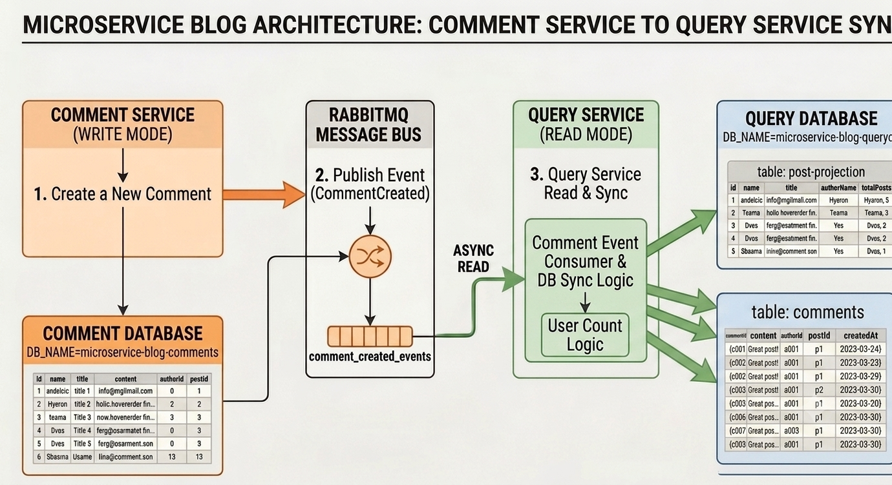

# Blog App — Comment Service

This service manages the engagement layer of the application, handling all user interactions related to article feedback. Operating as a component of the CQRS Write Side (Command Side), it processes operations to add user commentary linked to specific posts. 

It handles transactions within its dedicated storage engine (`microservice-blog-comments`) and decouples its operations from content display dependencies by broadcasting event payloads (e.g., `CommentCreated`) into the RabbitMQ cluster to safely increment metrics such as total post interaction counters asynchronously.


## API Endpoints
| Method | Endpoint | Description |
|--------|----------|-------------| 
| POST | `/comment` | Create a comment | 


## Folder Structure

```
src/
│
├── config/ 
│   ├── database.ts                 # Database connections
│   └── rabbitmq.ts                 # RabbitMQ channel initialization
│
├── controllers/ 
│   └── comment.controller.ts 
│
├── entities/ 
│   └── Comment.ts 
│
├── middlewares/ 
│   └── auth.ts
│
└── app.ts 
```

## Figure: Comment Service

<div align="center">
  
  <br>
  <p><b>Figure: High level design (HLD) of Comment-service Work flow</b></p>
</div>
