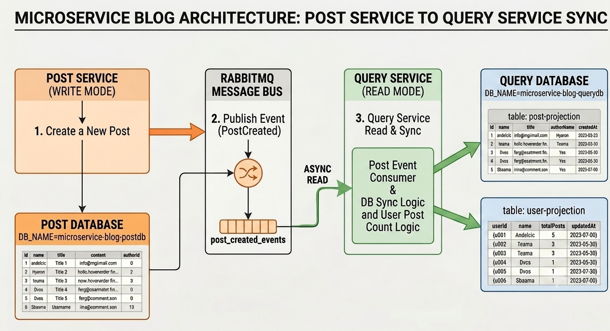

# Blog App — Post Service

This service governs the core content creation domain, managing the lifecycle of all articles and blog posts. Operating on the Write Side (Command Side) of the CQRS architecture, its responsibilities are strictly confined to handling post creation. 

To maintain isolation, it writes data directly into its own transactional store (`microservice-blog-posts`). Upon processing any command successfully, it broadcasts domain-specific events—such as `PostCreated`—across the RabbitMQ message bus to asynchronously notify the Query Service to compute and update content delivery projections.


## API Endpoints
| Method | Endpoint | Description |
|--------|----------|-------------| 
| POST | `/post` | Create a post | 


## Folder Structure

```
src/
│
├── config/ 
│   ├── database.ts                 # Database connections
│   └── rabbitmq.ts                 # RabbitMQ channel initialization
│
├── controllers/ 
│   └── post.controller.ts 
│
├── entities/ 
│   └── Post.ts 
│
├── middlewares/ 
│   └── auth.ts
│
└── app.ts 
```

## Figure: Post Service

<div align="center">
  
  <br>
  <p><b>Figure: High level design (HLD) of Post-service Work flow</b></p>
</div>
