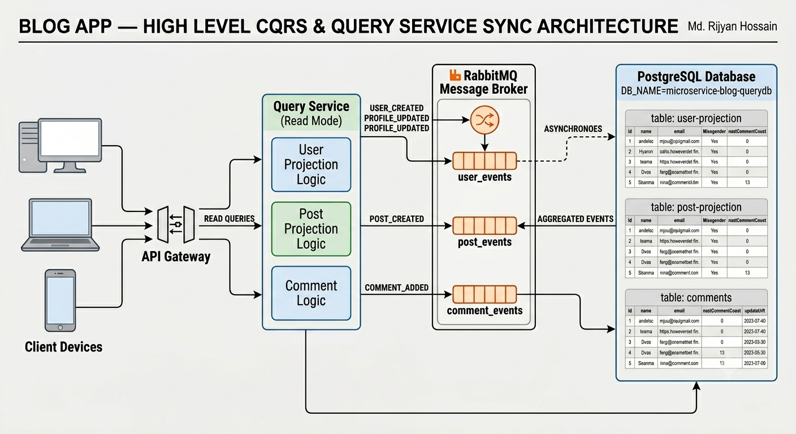

# Blog App — Query Service 
This service functions exclusively as the Read Model / Query Side of the application's CQRS (Command Query Responsibility Segregation) architecture. It listens asynchronously to events streamed from other microservices over RabbitMQ. 


## API Endpoints
| Method | Endpoint | Description |
|--------|----------|-------------| 
| GET | `/query/user` | Get all users | 
| GET | `/query/user/:id` | Get single user | 
| GET | `/query/post` | Get all users | 
| GET | `/query/post/:id` | Get single user | 


## Folder Structure

```
src/
│
├── config/ 
│   ├── database.ts                 # Database connections
│   └── rabbitmq.ts                 # RabbitMQ channel initialization
│
├── routes/                         
│   ├── user.route.ts 
│   └── post.route.ts 
│
├── controllers/ 
│   ├── user.query.controller.ts 
│   └── post.query.controller.ts 
│
├── entities/ 
│   ├── UserProjection.ts
│   ├── PostProjection.ts 
│   └── Comments.ts 
│
├── events/ 
│   └── consumer.ts                  # RabbitMQ consumers that read events & sync database 
│
├── middlewares/ 
│   └── auth.ts
│
└── app.ts                           # Service entry point 
```

## Figure: Query Service

<div align="center">
  
  <br>
  <p><b>Figure: High level design (HLD) of Query-service Work flow</b></p>
</div>
