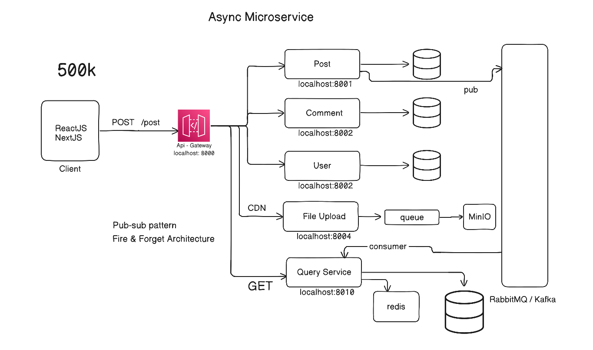

# Blog App — Microservices

A blogging platform built with a microservices architecture. <br> 
Each service is independently deployable, communicates asynchronously via a message bus, and owns its own database.

--- 

## Services Structure

```
blog/
│
├── api-gateway/
├── user/
├── post/
├── comment/
├── file-service/
├── query-service/
│
├── docker-compose.yml 
└── README.md 
```

Each service folder contains its own `README.md` with setup, env vars. <br>
Each service has its own `.env`. See the `.env.example` inside each service directory for the required variables.

--- 

## Services

| Service | Port | Responsibility |
|---|---|---|
| `api-gateway` | 8000 | Single entry point — routes requests to services |
| `post` | 8001 | Post Service |
| `comment` | 8002 | Comment Service |
| `user` | 8003 | User Service - Registration, login, JWT auth, token refresh <br> Profile Service - Update your profile |
| `file-service` | 8004 | Upload photo here to MinIO, S3 compatible service |
| `query-service` | 8010 | Serves all GET requests |

<div align="center">
  
  <br>
  <p><b>Figure: Mount Blog - Project Architecture</b></p> 
</div>

---

## Architecture

```
Client
  │
  ▼
API Gateway (8000)
  │
  ├──▶ User Service    (write) 
  ├──▶ Post Service    (write) 
  ├──▶ Comment Service (write) 
  ├──▶ File Service    (write) 
  └──▶ Query Service   (read) 

Write Services ──▶ RabbitMQ (blog_bus) ──▶ Query Service
```

All write operations go to the respective service. <br> 
All read operations go to the Query Service, which maintains its own synced database.

---


## CQRS Pattern

This project applies **Command Query Responsibility Segregation (CQRS)**:

- **Commands** (writes) are handled by `user`, `post`, and `comment` services. Each has its own PostgreSQL database and is the source of truth for its domain.
- **Queries** (reads) are handled exclusively by the `query-service`, which listens to events from the message bus. <br> 
All HTTP `GET` Request is handled by query-service. 

This separation means reads and writes can scale independently, and the query service can shape its data however best suits the client — without coupling to the write models.

<div align="center">
  
  <br>
  <p><b>Figure: Command Query Responsibility Segregation (CQRS)</b></p> 
</div>

--- 

## Event Bus — RabbitMQ

Services communicate via **RabbitMQ** using a fanout exchange (`blog_bus`).

When a write service performs an action, it publishes an event:

| Event | Published by |
|---|---|
| `UserCreated` | user service |
| `ProfileUpdated` | user service |
| `PostCreated` | post service |
| `CommentCreated` | comment service |

`The query service subscribes` to all events and updates its own database accordingly. <br>
Services are fully decoupled — publishers don't know who's listening.

---

## Tech Stack

| Layer | Technology |
|---|---|
| Runtime | Node.js + TypeScript |
| Framework | Express |
| Auth | JWT (access token + refresh token rotation) |
| ORM | TypeORM |
| Database | PostgreSQL (one per service) |
| Image Storage | MinIO |
| Cloudflare Tunnel | Used this CDN service to cache images |
| Message Bus | RabbitMQ (amqplib v2) |
| API Gateway | Express reverse proxy |

---

## Getting Started

### Prerequisites

- Node.js 18+
- PostgreSQL (for services)
- Docker Desktop (for RabbitMQ, MinIO, Cloudflare Tunnel)

---

### Start All Dependencies with Docker Compose

```bash
# Start RabbitMQ, MinIO, and Cloudflare Tunnel
docker-compose up -d
```


### This spins up:

| Container |	Port |Purpose |
|---|---|---|
| blog-rabbitmq	| 5672, 15672	| Message broker |
| blog-minio	| 9000, 9001	| Image storage |
| blog-cloudflare-tunnel	| —	| Public image access via Cloudflare |

### Set MinIO Bucket Public (one-time)

```bash
docker run --rm minio/mc alias set myminio http://localhost:9000 minioadmin minioadmin
docker run --rm minio/mc anonymous set public myminio/microservice-blog-files
```


### Get Cloudflare Tunnel URL

```bash
docker-compose logs cloudflare-tunnel

# Copy the URL (e.g., https://xxxxxx.trycloudflare.com) and update your file-service/.env:
CLOUDFLARE_URL=https://xxxxxx.trycloudflare.com
```

### Run Each Service

```bash
# From each service directory
npm install
npm run dev
```

### Stop All Docker Services

```bash
docker-compose down
```

### Reset Everything (clean start) 

```bash
docker-compose down
docker volume rm minio_data blog_minio_data   # optional, deletes stored images
docker-compose up -d
```

### Notes 

- The file-service uses MinIO for image storage. Images are served via Cloudflare Tunnel for development.

- For production, replace the Cloudflare Tunnel with a custom domain and Cloudflare DNS (orange cloud).

- All services require their own PostgreSQL database. Use separate databases per service.

- Create all database before running docker-compose. Get database names from .env of each service directory.  


