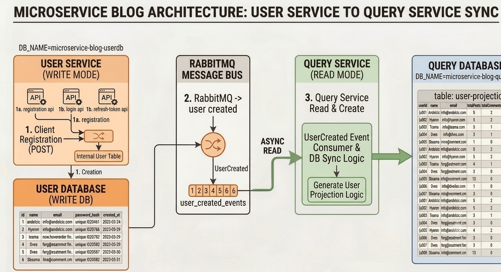

# Blog App — User Service

This service acts as the primary identity, authentication, and core profile provider for the application. Operating on the Write Side (Command Side) of the CQRS architecture, it is responsible for handling state changes regarding identity management—such as user registration, secure login validation, and direct account profile modification. 

Whenever a user's core state or profile changes, this service securely commits the transaction to its isolated write database (`microservice-blog-userdb`) and immediately publishes corresponding transactional events (e.g., `USER_CREATED`, `PROFILE_UPDATED`) to RabbitMQ so downstream services stay synchronized.


## API Endpoints

### Auth APIs
| Method | Endpoint | Description |
|--------|----------|-------------| 
| POST | `/user/login` | User can login | 
| POST | `/user/registration` | User can create an account | 
| POST | `/user/refresh-token` | Refresh token when access-token expired | 

### Profile API
| Method | Endpoint | Description |
|--------|----------|-------------| 
| PATCH | `/profile` | Update profile information | 


## Folder Structure

```
src/
│
├── config/ 
│   ├── database.ts                 # Database connections
│   └── rabbitmq.ts                 # RabbitMQ channel initialization
│
├── controllers/ 
│   ├── auth.controller.ts
│   └── profile.controller.ts 
│
├── entities/ 
│   ├── User.ts 
│   ├── Profile.ts 
│   └── RefreshToken.ts 
│
├── middlewares/ 
│   └── auth.ts
│
└── app.ts 
```

## Figure: User Service

<div align="center">
  
  <br>
  <p><b>Figure: High level design (HLD) of User-service Work flow</b></p>
</div>
